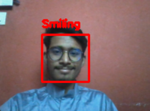
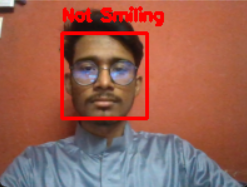

# Real Time Smile Detector

I have used **miniVGGNet** to create a real time smile detector with the use of [SMILEs Dataset](https://github.com/hromi/SMILEsmileD). **miniVGGNet** is lightweight but at the same time gives satisfactory accuracy.

To avoid the model to get confused by the surrounidgs/background, I used _Haar Cascade_ to focus on the face.

## How to run:

Run the `detector.py`

## Example Images: 

 

